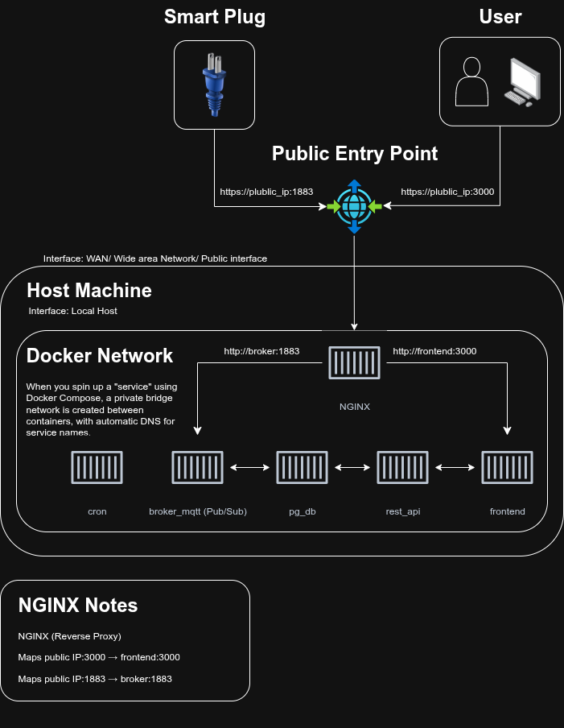

# ZotPlug Firmware

Full-stack Infrastructure & Firmware for our ZotPlug smart plug system. 


## 💻⚙️Software Development Workflow

### **Pre-requisites**  
1. Install **Docker**
   [Follow the official instructions for your platform](https://docs.docker.com/engine/install/#supported-platforms)

### **Dev-Steps**  
1. **Navigate to the backend infrastructure directory**
   ```bash
   cd ./zot_plug/infra
   ```

2. **Start the development stack**
   Run with the `dev` profile to launch only development-specific containers:

   ```bash
   docker compose --profile dev up
   ```
   > This will start services like `api-dev`, `postgres`, and any other containers tagged with `profiles: ["dev"]`.

## 🛠️Hardware Development Workflow

### Dependencies

- Arduino CLI for building and flashing
- Serial monitor tool (arduino-cli monitor, minicom, etc.)

### **Pre-requisites**  
1. Install **Node.js** and **npm**  
   [https://docs.npmjs.com/downloading-and-installing-node-js-and-npm](https://docs.npmjs.com/downloading-and-installing-node-js-and-npm)

2. Navigate to the broker directory ( From Project Root )
   ```bash
   cd ./infra/broker_mqtt
   ```

3. Install project dependencies  
   ```bash
   npm install
   ```
### **Dev-Steps**  

1. **Update Network Config**  
   Open `./esp_client/src/main.cpp` and update your network credentials.

2. **Run the MQTT Broker**  
   From the project root, run:

   ```bash
   npx tsx ./infra/broker_mqtt/server.ts
   ```
3. **Develop Firmware**
   Navigate to:
   ```bash
   ./esp_client/src
   ```
4. **Flash & Test**  
   Reflash the ESP32 and test against your local broker.

### Flashing & Monitoring

```bash
arduino-cli compile --fqbn esp32:esp32:esp32 .
arduino-cli upload -p /dev/ttyUSB0 --fqbn esp32:esp32:esp32 .
arduino-cli monitor -p /dev/ttyUSB0 -c baudrate=115200
```

## 📡 Network Notes

- Ensure your computer and the ESP32 are on the same WiFi network.
- Default MQTT port: 1883

## 📝 Setup Documentation

For complete setup instructions, see the [Setup Guide on Google Docs](https://docs.google.com/document/d/1jFlQuHnFwy8aJPPMJ6DQvYgvtMj_6Ua5th_mMhYTuXo/edit?usp=sharing).

## Diagrams & Architecture



