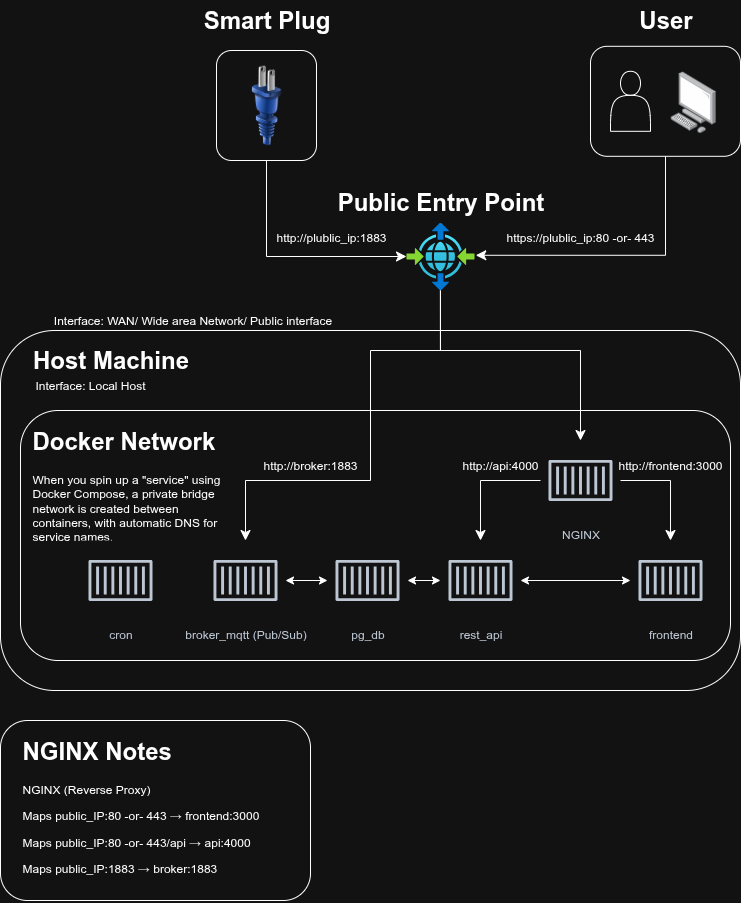
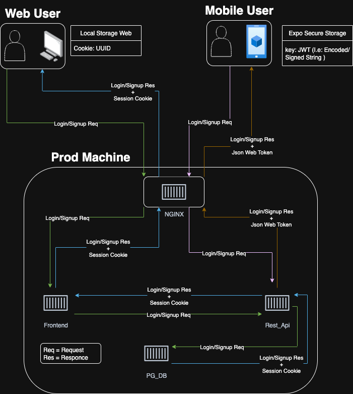
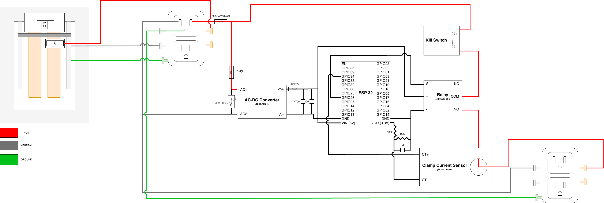

# ZotPlug Firmware

Full-stack Infrastructure & Firmware for our ZotPlug smart plug system. 


## 💻⚙️Software Development Workflow

### **Pre-requisites**  
1. Install **Docker**
   [Follow the official instructions for your platform](https://docs.docker.com/engine/install/#supported-platforms)

### **Dev-Steps**  
1. **Navigate to the backend infrastructure directory**
   ```bash
   cd ./zot_plug_platform/infra
   ```
2. **Create a .env file, with the following:**
   ```bash
   PG_HOST=postgres-dev
   PG_PORT=5432
   PG_USER=myuser
   PG_PASSWORD=mypassword
   PG_DATABASE=mydb
   MQTT_URL=mqtt://broker:1883
   SIGNING_KEY=super_duper_secret
   ```
3. **Start the development stack**
   Run with the `dev` profile to launch only development-specific containers:

   ```bash
   docker compose --profile dev up
   ```
   > This will start services like `api-dev`, `postgres`, and any other containers tagged with `profiles: ["dev"]`.

## 🛠️Hardware Development Workflow

### **Pre-requisites**  
1. Install **Node.js** and **npm**  
   [https://docs.npmjs.com/downloading-and-installing-node-js-and-npm](https://docs.npmjs.com/downloading-and-installing-node-js-and-npm)

2. Navigate to the broker directory ( From Project Root )
   ```bash
   cd ./infra/broker_mqtt
   ```
3. Install project dependencies  
   ```bash
   npm install
   ```
4. Install **PlatformIO Core (CLI)**:  
   **MacOS**:
   ```bash
   brew install platformio
   ```
   **Windows & Linux**:  
   [Installer Script (Recommended)](https://docs.platformio.org/en/latest/core/installation/methods/installer-script.html)  
   -or-  
   [Python Package Manage](https://docs.platformio.org/en/latest/core/installation/methods/pypi.html)

5. Install **Arduino CLI**:
   [https://arduino.github.io/arduino-cli/0.32/installation/](https://arduino.github.io/arduino-cli/0.32/installation/)

### **Dev-Steps**  

1. **Update Network Config**  
   - Open `./esp_client/data`
   - Copy `config.env.example` to `config.env`
   - Update your network and device credentials in `config.env`

2. **Upload `config.env` into ESP32**  
   - Navigate to `./esp_client/`
   - Plug in your ESP32
   - Run:
     ```bash
     pio run --target uploadfs
     ```
   > **Note:** To remove `config.env`:
   > ```bash
   > pio run -t erase
   > # You will need to re-upload your code as well (this wipes the entire flash)
   > ```

3. **Run the MQTT Broker**  
   From the project root, run:
   ```bash
   npx tsx ./infra/broker_mqtt/server.ts
   ```
4. **Develop Firmware**
   Navigate to:
   ```bash
   ./esp_client/src
   ```
5. **Flash & Test**  
   Reflash the ESP32 and test against your local broker.

### Flashing & Monitoring

```bash
arduino-cli compile --fqbn esp32:esp32:esp32 .
arduino-cli upload -p /dev/ttyUSB0 --fqbn esp32:esp32:esp32 .
arduino-cli monitor -p /dev/ttyUSB0 -c baudrate=115200
```

## 📡 Network Notes

- Ensure your computer and the ESP32 are on the same WiFi network.
- Default MQTT port: 1883

## 📝 Setup Documentation

For complete setup instructions, see the [Setup Guide on Google Docs](https://docs.google.com/document/d/1jFlQuHnFwy8aJPPMJ6DQvYgvtMj_6Ua5th_mMhYTuXo/edit?usp=sharing).

## Diagrams & Architecture


## Database ER Diagram


## Auth Provision Workflow


## Hardware Diagram



